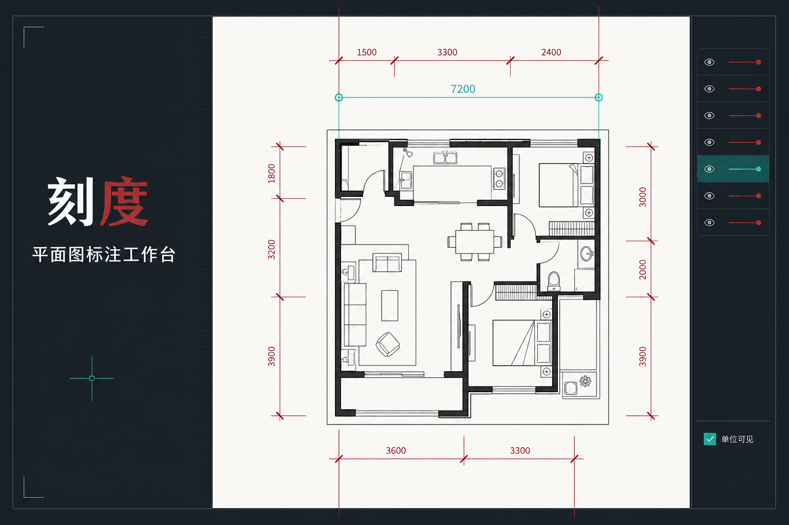

<div align="center">

# 刻度 · 建筑平面图快速标注工具

**上传一张没有尺寸的平面图，校准一次比例，就能像 CAD 一样快速标注、复制和导出。**

把原本反复经历的“截图 → 导入 CAD → 猜墙厚 → 缩放 → 标尺寸 → 截图”缩短成几分钟。

[**立即在线使用**](https://lan1126-lan.github.io/arch-s-tool/) · [提交建议](https://github.com/lan1126-lan/arch-s-tool/issues)

</div>



## 它解决什么问题？

建筑、室内和空间设计师做竞品分析时，经常只能从公众号、小红书、Pinterest、ArchDaily 或 gooood 获取没有尺寸的平面图。为了判断开间、进深、墙厚和家具尺度，通常还得把图片放进 CAD，按已知墙厚重新缩放，再一根一根画尺寸线。

**刻度**把这套重复工作变成一个浏览器工具：

- 本地上传 PNG、JPG 或 WebP，也可以复制图片后直接按 `Ctrl+V / ⌘V` 粘贴；导入后可先裁掉标题栏、白边和无关区域。
- 在图上画一段已知长度，例如 `200 mm` 墙厚，自动建立图片比例。
- 使用正交、端点、中点、交点和对齐吸附，像 CAD 一样准确落点。
- 支持单段三点标注和连续逐点标注。
- 一键复制到 PPT、Figma 或微信，也可以保存为 PNG。
- 图纸只在当前浏览器中处理，不需要上传到资料库。

## 1 分钟上手

### 1. 打开并裁切图纸

点击首屏或右上角的 **“本地上传”** 选择平面图；也可以先复制图片或截屏，再点击 **“粘贴图片”**，或直接按 `Ctrl+V / ⌘V`。导入后可以：

- 直接使用原图；
- 框选需要保留的范围；
- 用滚轮缩放裁切预览；
- 按住鼠标中键拖动画面。

### 2. 校准真实比例

1. 选择左侧 **“比例校准”**，或按 `R`。
2. 在图上点击一段已知尺寸的两个端点。
3. 输入真实长度和单位，例如墙厚 `200 mm`。

完成后，程序会自动计算每个像素对应的真实尺寸。

### 3. 开始标尺寸

#### 单段标注 `D`

采用标准三点式操作：

1. 第一次点击尺寸起点；
2. 第二次点击尺寸终点；
3. 第三次点击自由确定尺寸线的方向和偏移距离。

#### 连续／逐点标注 `C`

第一段同样点击三次，用来确定尺寸线的距离和方向。之后只需继续点击新的测量点，**每点一次就自动生成一段新尺寸**，并沿用第一段的排布位置。

竖向尺寸的数字会自动旋转 90°，横向尺寸保持水平显示。

### 4. 复制或保存

- 点击 **“复制图片”**：直接粘贴到 PPT、Figma、微信等软件。
- 点击 **“保存 PNG”**：下载完整白色图布，图纸与所有标注保持一致。
- 右侧可以切换 `mm / cm / m`，也可以选择是否在图中显示单位。

## 像 CAD 一样操作

| 操作 | 快捷键／鼠标 |
| --- | --- |
| 选择标注 | `V` |
| 删除选中标注 | `Delete` / `Backspace` |
| 比例校准 | `R` |
| 单段三点标注 | `D` |
| 连续逐点标注 | `C` |
| 正交开关 | `F8` |
| 对象吸附开关 | `F3` |
| 撤销上一条 | `Ctrl / Cmd + Z` |
| 适合窗口 | `0` |
| 取消当前操作 | `Esc` |
| 结束连续标注 | `Enter` |
| 以光标为中心缩放 | 鼠标滚轮 |
| 平移画板 | 鼠标中键拖动，或按住空格拖动 |

对象吸附支持原始测量点、尺寸线偏移后的端点、中点、交点，以及水平／垂直对齐。开启 `F8` 时正交优先，不会因为吸附把线拉歪。

## 在线体验

无需注册，打开即可使用：

### [lan1126-lan.github.io/arch-s-tool](https://lan1126-lan.github.io/arch-s-tool/)

## 本地运行

需要 Node.js `22.13.0` 或更高版本。

```bash
git clone https://github.com/lan1126-lan/arch-s-tool.git
cd arch-s-tool
npm install
npm run dev
```

生产构建：

```bash
npm run build
```

主要技术：React、TypeScript、Canvas、vinext 和 Cloudflare Workers。

## 为什么叫“刻度”？

因为我们需要的不是另一个复杂的制图软件，而是一把随手就能用的数字尺子。

如果它帮你少开了一次 CAD、少画了几十根尺寸线，欢迎把在线地址分享给身边做建筑、室内和竞品研究的朋友。也欢迎在 [Issues](https://github.com/lan1126-lan/arch-s-tool/issues) 留下你最想要的下一项功能。
